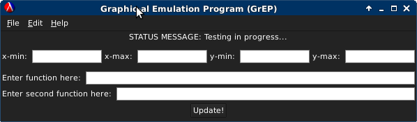
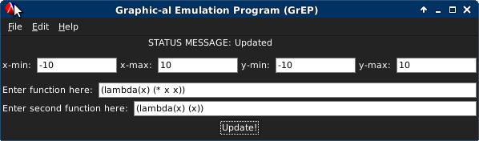
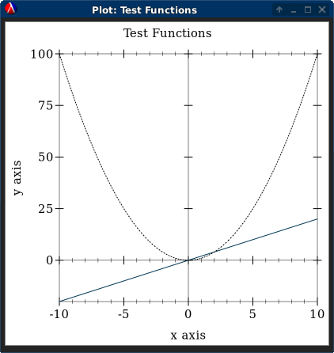

## Website Link:
Our website is here: (http://opls15projects.github.io/GrEP/)


##Authors
Our team, Dual-Core Processors, consists of Michael Forsyth, Nicholas Forsyth, and Emily Seto.


##Overview
In our earlier discussions, we began thinking about how there needs to be a simpler way for individuals with non-technical backgrounds to utilize the capabilities of plotting mathematical functions. Our software will provide this solution.


##Screenshots

>This is how the **gui frame** first looks when the software starts up.


>This is how the same window looks after inputting lower and upper bounds for the x-, y-coordinates on a Cartesian plane. **Note that this particular part is still in development.** For now, all function inputs must be written in the form of a **lambda**, as shown above.


>This is the new plot created with the given user input.

*Note:* The gui will appear different depending on operating systems.


##Concepts Demonstrated
* Our use of racket/gui included **object-orientation** when we designed the frame and panels.
* **Data abstraction** is used to ascertain user input from the gui.
* The concept of **higher-order procedures** is represented by the simpler procedures written in our software.
* **Symbol manipulation** utilized Racket reader to simplify input by using *eval*.


##External Technology and Libraries
For this project, we used the following libraries:
* **racket/gui/base** (http://docs.racket-lang.org/gui/)
* **plot** (http://docs.racket-lang.org/plot/)

Racket's **gui** library provides the classes and procedures that allowed us to create a graphical user interface. Our team used **gui** to create a new frame (a window), a horizontal panel within that frame, and used a few different widgets to attain user input (such as the button and text-field widgets). 


The **plot** library allows us to produce any plot (or graph) we desire. From the user input we ascertained from **gui**, our team was able to plot that information to create graphs desired by the user.


##Favorite Lines of Code
####Michael Forsyth (@mike01720)
My favorite line is the eval read... that I used to read in the input. I like it because it utilizes a bunch of procedures that result in the expected net result. This follows the theory of functional code to let smaller procedures do the work for you.

```scheme
(function (eval (read (open-input-string (send i-func1 get-value)))) #:color 0 #:style 'dot)
```


####Nicholas Forsyth (@nick01720)
I would say my favorite line of code would be the initial creation of the window frame that creates a sandbox area for gui. From that one line, the gui framework is started and anything can be created from it. It's a simple building block that sets the foundation for many more.

```scheme
(define frame (new frame%
                   (label "Graphic-al Emulation Program (GrEP)")
                   (height 150)
                   (width 350)))
```


####Emily Seto (@svnaptic)
My favorite lines of code are the ones that capture the values inputted at the text-fields (by defining them), and using those new bindings as parameters to other procedures. This exemplifies the concepts of creating simple functions and abstracting immutable data in higher-order procedures.

```scheme
             (define xmin (send i-xmin get-value))
             (define xmax (send i-xmax get-value))
             (define ymin (send i-ymin get-value))
             (define ymax (send i-ymax get-value))
             
             
             (eval (read (open-input-string xmin))) 
             (eval (read (open-input-string xmax))) 
             ...
             (eval (read (open-input-string ymin))) 
             (eval (read (open-input-string ymax)))
```


#How to Download and Run
There are links at the top of this webpage for downloading this program.
* Download .zip (https://github.com/oplS15projects/GrEP/zipball/master)
* Download .tar.gz (https://github.com/oplS15projects/GrEP/tarball/master)


Depending on which version you download, unzip or untar your download. There should be *gui.rkt* and *plot.rkt*. While you can view both files to gain a better understanding of how our program works, opening **plot.rkt** should suffice when interacting with it. Run that file in Dr. Racket, and a *gui window* should pop-up. Enter any mathematical function in pre-fix notation, all of it wrapped up in a nice little lambda, and fill out the consequent text-fields to your preference. Hit **enter**, and a new plot should appear!


Currently, our latest release is Milestone 2: (https://github.com/oplS15projects/GrEP/releases/tag/Milestone2)
